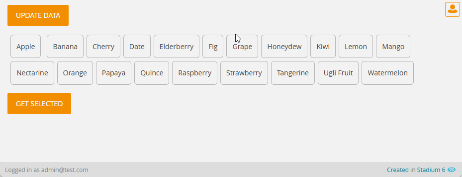

# Selectable Buttons

Some CSS that turns a `CheckBoxList` into a set of selectable buttons



## Version 
1.0 - initial

# Setup

## Application Setup
1. Check the *Enable Style Sheet* checkbox in the application properties

## Page Setup
1. Drag a `CheckBoxList` control to the page 
2. Add a class called "stadium-selectable-buttons" into the control classes property
3. Use like any other `CheckBoxList`

## CSS
The CSS below is required for the correct functioning of the module. Variables exposed in the [*selectable-buttons-variables.css*](selectable-buttons-variables.css) file can be [customised](#customising-css).

1. Create a folder called "CSS" inside of your Embedded Files in your application
2. Drag the CSS files from this repo [*selectable-buttons.css*](selectable-buttons.css) into that folder
3. Paste the link tag below into the *head* property of your application
```html
<link rel="stylesheet" href="{EmbeddedFiles}/CSS/selectable-buttons.css">
``` 

### Customising CSS
1. Open the CSS file called [*selectable-buttons-variables.css*](selectable-buttons-variables.css) from this repo
2. Adjust the variables in the *:root* element as you see fit
3. Stadium 6.12+ users can comment out any variable they do **not** want to customise
4. Add the [*selectable-buttons-variables.css*](selectable-buttons-variables.css) to the "CSS" folder in the EmbeddedFiles (overwrite)
5. Paste the link tag below into the *head* property of your application (if you don't already have it there)
```html
<link rel="stylesheet" href="{EmbeddedFiles}/CSS/selectable-buttons-variables.css">
``` 
6. Add the file to the "CSS" inside of your Embedded Files in your application

**NOTE: Do not change any of the CSS in the 'selectable-buttons.css' file**

## Upgrading Stadium Repos
Stadium Repos are not static. They change as additional features are added and bugs are fixed. Using the right method to work with Stadium Repos allows for upgrading them in a controlled manner. 

How to use and update application repos is described here: [Working with Stadium Repos](https://github.com/stadium-software/samples-upgrading)